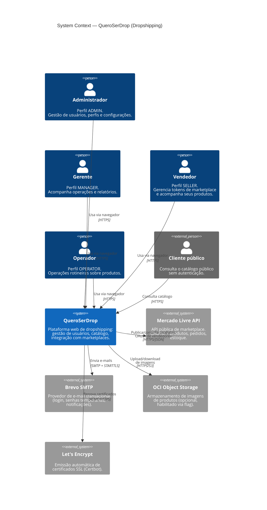
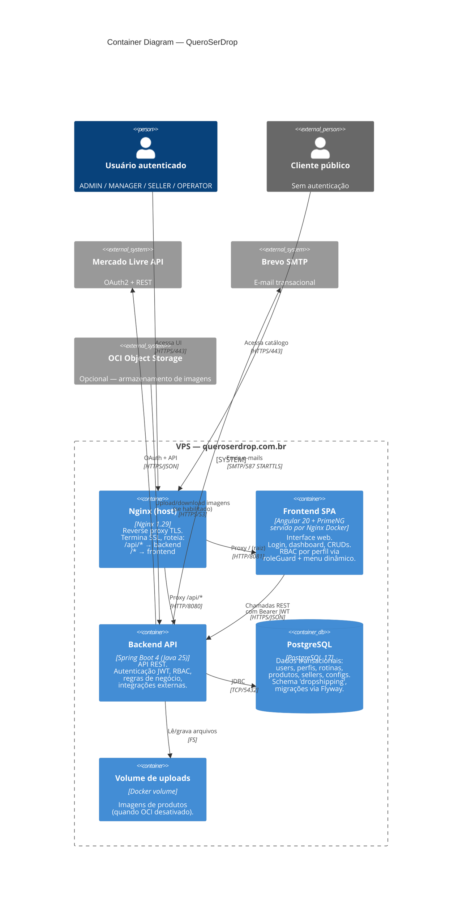

# Diagramas C4 — QueroSerDrop (Dropshipping)

Modelagem C4 (níveis 1 a 3) do sistema de dropshipping, usando sintaxe [Mermaid C4](https://mermaid.js.org/syntax/c4.html).
Estes diagramas renderizam nativamente no GitHub, Cursor, VS Code e na maioria dos editores Markdown com suporte a Mermaid.

> **Legenda dos atores**
> - **Administrador (ADMIN)** — gestão de usuários, perfis, rotinas e configurações.
> - **Gerente (MANAGER)** — acompanhamento operacional.
> - **Vendedor (SELLER)** — cadastra seus tokens de marketplace e acompanha produtos.
> - **Operador (OPERATOR)** — operações rotineiras sobre produtos.
> - **Cliente público** — consulta o catálogo público (sem autenticação).

---

## Nível 1 — Contexto (System Context)

Visão de mais alto nível: quem usa o sistema e com quais sistemas externos ele se integra.

---

## Nível 2 — Containers

Desdobramento do sistema em unidades executáveis implantadas. Mostra como o tráfego flui do navegador até o banco e como se conecta aos serviços externos.

---

## Nível 3 — Componentes do Backend

Foco na arquitetura hexagonal (ports & adapters) do backend Spring Boot. Agrupa as camadas principais.

```mermaid
C4Component
    title Component Diagram — Backend (Spring Boot)

    Container(frontend, "Frontend SPA", "Angular", "Consome a API REST")
    ContainerDb(postgres, "PostgreSQL", "Postgres 17", "Dados transacionais")
    System_Ext(brevo, "Brevo SMTP", "E-mail")
    System_Ext(mercadoLivre, "Mercado Livre API", "OAuth + REST")
    System_Ext(oci, "OCI Object Storage", "Opcional")

    Container_Boundary(backend, "Backend API — Spring Boot") {

        Component(security, "Security Layer", "Spring Security + JWT", "JwtAuthenticationFilter,<br/>SecurityConfig, @PreAuthorize,<br/>GlobalExceptionHandler.<br/>Converte perfis em ROLE_*.")

        Component(authCtrl, "AuthController", "REST /api/v1/auth", "login, refresh,<br/>forgot-password, logout,<br/>first-login/password, /me")
        Component(userCtrl, "UserController", "REST /api/v1/users", "CRUD de usuários (ADMIN),<br/>atribuição de perfis,<br/>ativar/desativar.")
        Component(perfilCtrl, "PerfilController", "REST /api/v1/perfis", "CRUD de perfis<br/>e vínculo com rotinas.")
        Component(rotinaCtrl, "RotinaController", "REST /api/v1/rotinas", "CRUD de rotinas<br/>(itens de menu).")
        Component(productCtrl, "ProductController + ProductAdminController + ProductFileController", "REST /api/v1/products, /api/v1/admin/products, /api/v1/public/products", "Catálogo público,<br/>CRUD admin,<br/>upload de arquivos.")
        Component(sellerCtrl, "SellerController", "REST /api/v1/sellers", "CRUD de sellers<br/>(tokens de marketplace).")
        Component(configCtrl, "AppConfigController", "REST /api/v1/configs", "Configurações da aplicação.")
        Component(uploadCtrl, "UploadController", "REST /api/v1/uploads", "Upload genérico de arquivos.")

        Component(useCases, "Use Cases (application/*)", "Spring @Service", "Orquestração de regras:<br/>LoginUseCase, CreateUserUseCase,<br/>ChangePasswordUseCase,<br/>CreateBaseProductUseCase,<br/>AssignPerfisToUserUseCase, etc.")

        Component(domain, "Domain (domain/*)", "POJOs + exceptions", "Entidades e regras puras:<br/>User, Perfil, Rotina,<br/>Product, Seller, AppConfig.<br/>Exceptions de domínio.")

        Component(ports, "Ports (domain/*/port)", "Java interfaces", "Contratos da camada<br/>de aplicação:<br/>UserRepositoryPort,<br/>JwtProviderPort,<br/>PasswordEncoderPort,<br/>EmailSenderPort, etc.")

        Component(persistenceAdapters, "Persistence Adapters", "Spring Data JPA", "Implementa *RepositoryPort.<br/>Usa *JpaRepository +<br/>entidades JPA. Flyway<br/>gerencia migrations.")

        Component(securityAdapters, "Security Adapters", "Spring Security", "JwtProviderAdapter,<br/>BcryptPasswordEncoderAdapter.")

        Component(mailAdapter, "Mail Adapter", "JavaMailSender", "Envia e-mails via SMTP.<br/>Templates de recuperação<br/>de senha, etc.")

        Component(storageAdapter, "Storage Adapter", "OCI SDK / FS local", "Abstrai armazenamento<br/>de imagens.<br/>Flag OCI_OBJECT_STORAGE_ENABLED.")

        Component(mlAdapter, "Mercado Livre Adapter", "REST Client", "Integração OAuth2<br/>e chamadas REST.")
    }

    Rel(frontend, authCtrl, "POST/GET", "HTTPS/JSON")
    Rel(frontend, userCtrl, "CRUD", "HTTPS/JSON + Bearer")
    Rel(frontend, perfilCtrl, "CRUD", "HTTPS/JSON + Bearer")
    Rel(frontend, rotinaCtrl, "CRUD", "HTTPS/JSON + Bearer")
    Rel(frontend, productCtrl, "CRUD + upload", "HTTPS/JSON + Bearer")
    Rel(frontend, sellerCtrl, "CRUD", "HTTPS/JSON + Bearer")
    Rel(frontend, configCtrl, "CRUD", "HTTPS/JSON + Bearer")
    Rel(frontend, uploadCtrl, "multipart", "HTTPS")

    Rel(authCtrl, security, "valida token / autoriza")
    Rel(userCtrl, security, "valida token / autoriza")
    Rel(perfilCtrl, security, "valida token / autoriza")
    Rel(rotinaCtrl, security, "valida token / autoriza")
    Rel(productCtrl, security, "valida token / autoriza")
    Rel(sellerCtrl, security, "valida token / autoriza")
    Rel(configCtrl, security, "valida token / autoriza")

    Rel(authCtrl, useCases, "invoca")
    Rel(userCtrl, useCases, "invoca")
    Rel(perfilCtrl, useCases, "invoca")
    Rel(rotinaCtrl, useCases, "invoca")
    Rel(productCtrl, useCases, "invoca")
    Rel(sellerCtrl, useCases, "invoca")
    Rel(configCtrl, useCases, "invoca")
    Rel(uploadCtrl, useCases, "invoca")

    Rel(useCases, domain, "usa entidades/regras")
    Rel(useCases, ports, "depende de interfaces")

    Rel(persistenceAdapters, ports, "implementa")
    Rel(securityAdapters, ports, "implementa")
    Rel(mailAdapter, ports, "implementa")
    Rel(storageAdapter, ports, "implementa")
    Rel(mlAdapter, ports, "implementa")

    Rel(persistenceAdapters, postgres, "JDBC", "TCP/5432")
    Rel(mailAdapter, brevo, "SMTP", "TCP/587")
    Rel(storageAdapter, oci, "S3 API", "HTTPS")
    Rel(mlAdapter, mercadoLivre, "OAuth + REST", "HTTPS/JSON")

    UpdateLayoutConfig($c4ShapeInRow="3", $c4BoundaryInRow="1")
```

---

## Nível 3 — Componentes do Frontend

Mesma visão de componentes, mas para o SPA Angular. Destaca o fluxo de autenticação, RBAC e módulos de feature.

```mermaid
C4Component
    title Component Diagram — Frontend (Angular)

    Person(user, "Usuário", "Perfis ADMIN / MANAGER / SELLER / OPERATOR")
    Container(backend, "Backend API", "Spring Boot", "API REST com JWT")

    Container_Boundary(fe, "Frontend — Angular 20 + PrimeNG") {

        Component(router, "App Routes", "Angular Router", "Rotas com lazy loading.<br/>authGuard + roleGuard<br/>(/usuarios → ADMIN).")

        Component(authGuard, "authGuard", "CanActivateFn", "Verifica token válido<br/>e necessidade de troca<br/>de senha.")
        Component(roleGuard, "roleGuard", "CanActivateFn", "Verifica route.data.roles<br/>contra perfis do usuário.<br/>Redireciona para<br/>/unauthorized.")

        Component(authInterceptor, "authInterceptor", "HttpInterceptor", "Injeta Bearer JWT.<br/>Trata 401 (refresh) e<br/>403 (→ /unauthorized).")

        Component(authService, "AuthService", "Injectable", "Signals: currentUser,<br/>currentUserPerfis.<br/>login, logout, refresh,<br/>idle timeout.")
        Component(usersService, "UsersService", "HttpClient", "CRUD /api/v1/users.")
        Component(perfisService, "PerfisService", "HttpClient", "CRUD /api/v1/perfis.")
        Component(rotinasService, "RotinasService", "HttpClient", "CRUD /api/v1/rotinas.")
        Component(productsService, "Products + AdminProducts Service", "HttpClient", "Catálogo e CRUD admin.")
        Component(sellersService, "SellersService", "HttpClient", "CRUD /api/v1/sellers.")

        Component(sidebar, "SakaiSidebar", "Component", "Menu dinâmico<br/>a partir dos perfis/rotinas<br/>do usuário.")
        Component(topbar, "SakaiTopbar", "Component", "Cabeçalho + avatar.")
        Component(mainLayout, "MainLayout", "Component", "Casca autenticada.")

        Component(featUsers, "Feature: Usuários", "Standalone Components", "users-list (CRUD).<br/>Restrito a ADMIN.")
        Component(featPerfis, "Feature: Perfis", "Standalone Components", "perfis-list.")
        Component(featRotinas, "Feature: Rotinas", "Standalone Components", "rotinas-list.")
        Component(featProducts, "Feature: Produtos", "Standalone Components", "products-list,<br/>product-base-create/edit.")
        Component(featSellers, "Feature: Sellers", "Standalone Components", "sellers-list.")
        Component(featAuth, "Feature: Auth", "Standalone Components", "login, forgot-password,<br/>change-password,<br/>unauthorized.")
    }

    Rel(user, router, "Navega", "HTTPS")

    Rel(router, authGuard, "canActivate")
    Rel(router, roleGuard, "canActivate (rotas restritas)")
    Rel(authGuard, authService, "isAuthenticated()")
    Rel(roleGuard, authService, "currentUserPerfis()")

    Rel(router, mainLayout, "renderiza")
    Rel(mainLayout, sidebar, "contém")
    Rel(mainLayout, topbar, "contém")
    Rel(sidebar, authService, "currentUserPerfis()")

    Rel(router, featAuth, "lazy load")
    Rel(router, featUsers, "lazy load (ADMIN)")
    Rel(router, featPerfis, "lazy load")
    Rel(router, featRotinas, "lazy load")
    Rel(router, featProducts, "lazy load")
    Rel(router, featSellers, "lazy load")

    Rel(featAuth, authService, "usa")
    Rel(featUsers, usersService, "usa")
    Rel(featPerfis, perfisService, "usa")
    Rel(featRotinas, rotinasService, "usa")
    Rel(featProducts, productsService, "usa")
    Rel(featSellers, sellersService, "usa")

    Rel(authService, authInterceptor, "tokens lidos pelo")
    Rel(usersService, authInterceptor, "via HttpClient")
    Rel(perfisService, authInterceptor, "via HttpClient")
    Rel(rotinasService, authInterceptor, "via HttpClient")
    Rel(productsService, authInterceptor, "via HttpClient")
    Rel(sellersService, authInterceptor, "via HttpClient")

    Rel(authInterceptor, backend, "HTTPS + Bearer JWT", "REST/JSON")

    UpdateLayoutConfig($c4ShapeInRow="3", $c4BoundaryInRow="1")
```

---

## Como visualizar

- **GitHub / GitLab / Bitbucket**: renderizam automaticamente (copie este arquivo para o repositório).
- **Cursor / VS Code**: instale a extensão "Markdown Preview Mermaid Support" e abra o preview (`Ctrl+Shift+V`).
- **IntelliJ / Rider**: plugin _Mermaid_.
- **Exportar como imagem**: cole cada bloco `mermaid` em [mermaid.live](https://mermaid.live) e exporte PNG/SVG.

## Próximos níveis (opcionais)

- **Nível 4 — Código**: diagramas de classes detalhados por caso de uso (ex.: fluxo de `LoginUseCase`). Normalmente não é necessário — o próprio código já serve.
- **Diagramas dinâmicos / deployment**: podemos adicionar um _Deployment diagram_ (VPS, Docker, volumes, rede) e _Dynamic diagrams_ (fluxo de login com JWT, fluxo OAuth do Mercado Livre), se fizer sentido.
